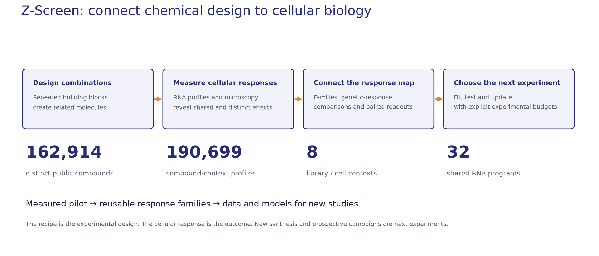

# Z-Screen pilot: chemical recipes and cellular responses

**Version 2.0.0**

Z-Screen connects combinatorial chemistry to high-dimensional cellular measurements. This pilot data resource contains **190,699 compound-context profiles from 162,914 public chemical recipes across eight library–cell contexts**. Each RNA response is available on a **6,000-gene panel** and as coordinates on **32 shared transcriptional programs**.

The package provides processed data, aligned identifiers, reference model weights and inference code, four worked notebooks, and selected evidence annexes. Recurring building blocks let researchers connect responses across related chemical combinations and develop models that predict how a recipe changes cell state.



## What you can use now

| Resource | Distributed objects | Guide |
|---|---|---|
| Recipes and RNA responses | Public compound/building-block IDs; eight gene-response matrices and program-usage matrices; explicit row and gene axes | [Data overview](docs/SCIENTIFIC_OVERVIEW.md#chemical-design-and-core-rna-data) |
| Reference model | Three checkpoints; building-block embeddings; CPU inference; fixed test folds and prediction fixtures | [Model guide](models/README.md) |
| Chemical response atlas | 1,007 original families; explicit memberships and gene/program centroids; 855 families with significant pathway annotations | [Original atlas](atlas/original_clusters/README.md) |
| Controls | 256,052 wells summarized as 1,259 control-by-batch profiles across five contexts | [Controls](annex_controls/README.md) |
| Imaging | Compound embeddings, marker measurements, available detection-level features, and two identified microscopy examples | [Imaging](annex_imaging/README.md) · [Gallery](gallery/README.md) |
| Directly paired image/RNA data | 11,435 wells, 35 controls, two batches; 448 image features and 32 native RNA encoder coordinates per well | [Same-well study](annex_same_well/README.md) |
| Selected analyses | Chemistry, response-family, hypothesis and genetic-correspondence tables; retrospective selection and measurement-design summaries | [Annex index](docs/ANNEX_INDEX.md) |

## Load a response and its recipe

From the full package folder, install the lightweight helpers:

```bash
python -m pip install -e .
```

```python
from zscreen_program_package import data

usages, compounds = data.load_usages("zel039_aec7")
recipes = data.load_recipes()
linked = compounds.merge(recipes, on="public_compound_id", validate="one_to_one")

print(usages.shape)       # (20813, 32)
print(linked.head())      # public IDs and building-block recipes
```

For the reference neural model, install its optional dependency and check the fixed predictions:

```bash
python -m pip install torch==2.5.1 --index-url https://download.pytorch.org/whl/cpu
python -m pip install -e ".[model]"
python models/predict.py --check-golden
```

CPU inference is supported. [Start Here](START_HERE.md) links the four notebooks, a recipe prediction example and the [data dictionary](docs/DATA_DICTIONARY.md). The core loaders and reference model work without external genetic-reference datasets.

## Examples of what the pilot can reveal

**A coherent chemical family.** In the AEC7 pilot, 1,512 compounds in the filtered measured series (from 2,267 core recipes carrying that building block) show a coherent aggregate RNA response: profiles from disjoint member-compound halves correlate at 0.981. The response resembles an HSPA5 genetic-perturbation signature, providing a biological reference for exploring the family. The halves share the source experiment collection; RNA correspondence does not establish direct target engagement. [Family example](annex_case_studies/01_hspa5_building_block/README.md).

**Learning from observations.** A retrospective selection evaluation recovers 44.54% of a predefined high-scoring HSPA5 response set after 1,400 selections with model updates, compared with 34.41% for a frozen model and 15.73% for random selection, averaged over three starts. These are retrospective response-score recovery rates. [Curves and endpoint definition](annex_case_studies/03_adaptive_replay/README.md).

**Designing measurements.** Selected analyses compare exact image/RNA pairing with shuffled pairing and examine how aggregating separately measured batches changes response agreement. The annex supplies processed results, figures and sampling definitions. [Measurement-design summary](annex_measurement_design/README.md).

These examples illustrate uses of the data. The package includes the current measurements, models, selected result tables and their interpretation. [Methods and data access](docs/ANALYSIS_ACCESS.md) describe the inputs required for additional upstream analyses.

**Quantitative reference results.** Held-out recipe prediction spans mean per-program Pearson 0.105–0.530 across eight contexts, with permutation-null z=6.1–28.1. [Evaluation definitions, building-block/imaging results and complementary resources](docs/PILOT_RESULTS_REFERENCE.md).

## Build with Zafrens

Use the public recipes and measurements to develop a model, explore a cellular response, or co-design a library and measurement campaign. For raw Z-Screen data, related analysis inputs, structure-level chemistry and collaboration enquiries, contact [hello@zafrens.com](mailto:hello@zafrens.com). External genetic-reference datasets are obtained from their original providers. [Access note](docs/ANALYSIS_ACCESS.md).

## Citation and reuse

Cite the exact package version and the original studies used in comparative analyses. [Citation metadata](CITATION.cff) · [Public reference studies](docs/REFERENCE_SOURCES.md) · [Download and verification](docs/DOWNLOAD.md).

Zafrens pilot data and model weights use CC BY-NC 4.0; software uses Apache 2.0. Selected external-reference-derived results retain source-specific terms. See the [component-aware license](LICENSE.md) before reuse.
