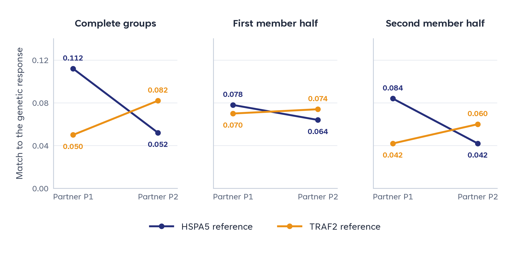

# Comparing responses across chemical partners

Two AEC7/ZEL039 groups share component S at `bb0` and differ at `bb1`. With P1, the aggregate RNA response more closely resembles the HSPA5 reference; with P2, it more closely resembles TRAF2. Both disjoint member-compound halves retain that preference.

*The vertical axis is signed RNA-response correspondence. Halves contain different compounds from the same experiment collection. This exploratory pattern does not establish a causal partner-dependent mechanism switch.*

| Group | Compounds | Retained cells | HSPA5 score | TRAF2 score |
|---|---:|---:|---:|---:|
| S + P1 | 48 | 203 | 0.112 | 0.050 |
| S + P2 | 52 | 267 | 0.052 | 0.082 |

[All full/half scores](data/response_scores.csv) · [Support](data/group_support.csv) · [Editable figure](figures/response_branch.svg).

## What the matched comparison adds

The completed analysis holds other recipe coordinates constant in **47 pairs**. The mean HSPA5 score difference is **0.00379**, with a 95% interval of **−0.00536 to 0.01285**. TRAF2 differs in the complete pair set (**−0.01255; −0.02077 to −0.00464**), but the smaller **18-pair common-stratum comparison is inconclusive for both endpoints**.

These results support an exploratory partner association. They leave the mechanism-switch question open without invalidating the parent family's coherence. A score of a pooled profile and an average of individual compound scores are different quantities. The six pair/interaction/sensitivity results are reported in [matched_endpoint_summary.csv](data/matched_endpoint_summary.csv); its differences are P1 minus P2, and its interaction is (P1−P2 on S)−(P1−P2 on S2). [partner_contrasts.csv](data/partner_contrasts.csv) uses the opposite P2-minus-P1 orientation.

## Chemical coordinates

| Label | Position | Public building-block ID |
|---|---|---|
| S | `bb0` | `BB_2371372935` |
| P1 | `bb1` | `BB_1599289689` |
| P2 | `bb1` | `BB_1748751977` |
| S2 | `bb0` | `BB_1722497045` |

Use the [coordinate table](data/recipe_coordinates.csv) and [core recipes](../../core/recipes.parquet) to inspect related combinations. The example shows how a combinatorial screen identifies a focused question for balanced follow-up measurements.

[Data scope](../../docs/ANALYSIS_ACCESS.md) · [Reference sources](../../docs/REFERENCE_SOURCES.md) · [Parent family](../01_hspa5_building_block/README.md).
