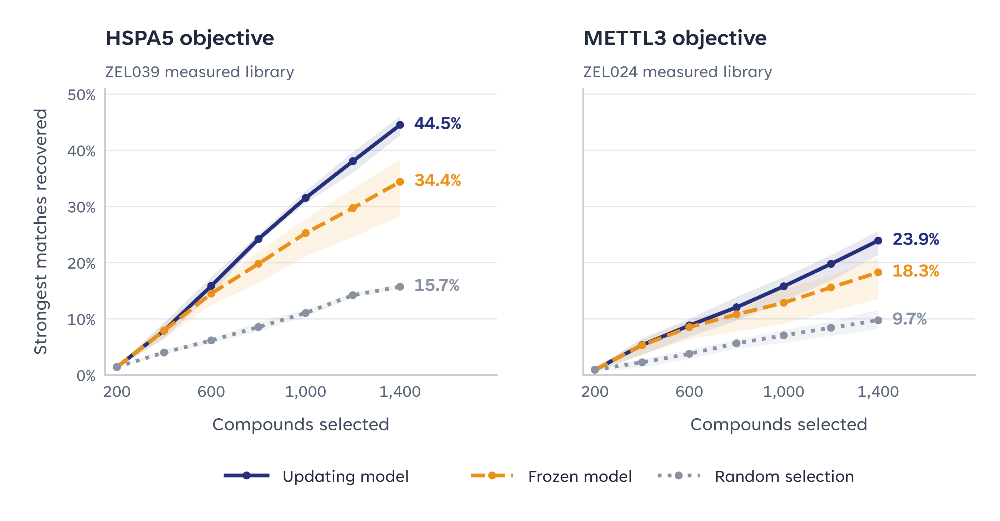

# Learning which chemical recipes to measure next

A retrospective replay uses existing measurements to compare three ways of selecting chemistry: update a model after each batch, keep its initial fit, or select randomly. Every strategy starts with the same 200 compounds and selects six more batches of 200.

*Retrospective selection comparison. Lines show the mean across three starting samples; shading spans their observed range. HSPA5 uses component and pair features; METTL3 uses component features. These are recovery rates for predefined RNA-response scores.*

At **1,400 unique selections**:

| Objective and chemical context | Updating model | Frozen model | Random selection |
|---|---:|---:|---:|
| HSPA5, AEC7/ZEL039 | **44.54%** | 34.41% | 15.73% |
| METTL3, HEK293/ZEL024 | **23.94%** | 18.28% | 9.75% |

[Per-start curves](data/selection_curves.csv) · [Endpoints and ranges](data/selection_endpoints.csv) · [Editable figure](figures/learning_curves.svg).

## What is learned and counted

The model uses the public building-block recipe to predict correspondence with a fixed genetic-response reference. A selected compound's stored response is revealed before the model selects the next batch. The fitted model changes; the learning procedure stays fixed. The display labels are **Updating model**, **Frozen model** and **Random selection**. In the CSVs these map to `acq_arm=greedy`, `static` and `random`; `policy_label` values are mapped in the [data guide](../DATA_GUIDE.md#3-adaptive-replay).

Recovery is the fraction of the full recipe-available library's **highest-scoring 5%** found by the strategy. The HSPA5 set contains 464 profiles and the METTL3 set 660. The denominator includes reserved test compounds, which cannot be acquired or used in supervised fitting. The three starts are seeds 20260914, 20260915 and 20260916. [Full figure definition](data/replay_definition.json).

This demonstrates the value of measurement feedback for these fixed retrospective objectives. The percentages are not validated inhibitor hit rates or a prospective discovery result. The HSPA5 chemical measurements are AEC7; their external genetic reference is teloHAEC. METTL3 uses the separate HEK293T reference described in the source note.

## Use in this pilot resource

The selection curves, denominators and task definitions are included so readers can inspect the comparison. These result tables do not contain every per-compound selection score or a complete acquisition model. The public core offers recipe and response objects for other models or objectives. [Data scope](../../docs/ANALYSIS_ACCESS.md) · [Genetic-reference sources](../../docs/REFERENCE_SOURCES.md).

[All examples](../README.md).
