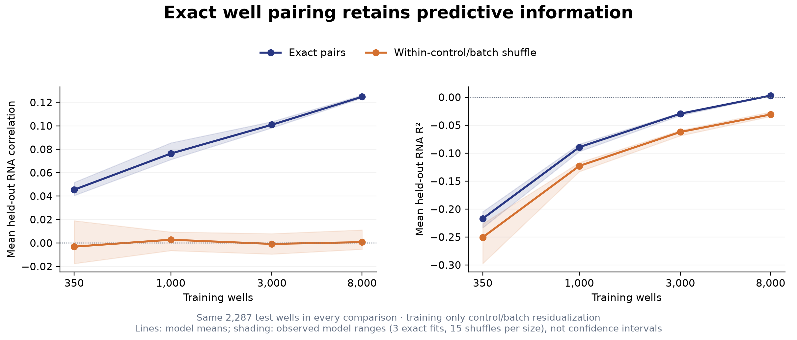
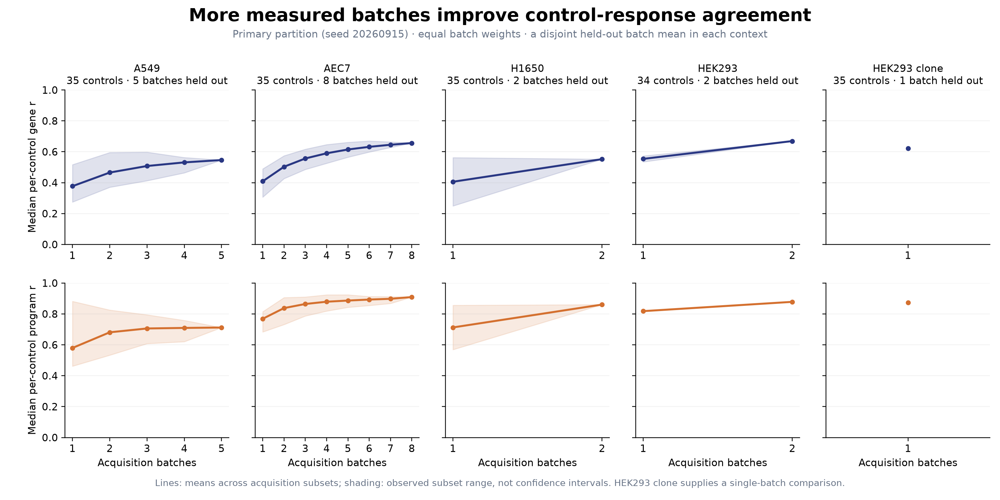
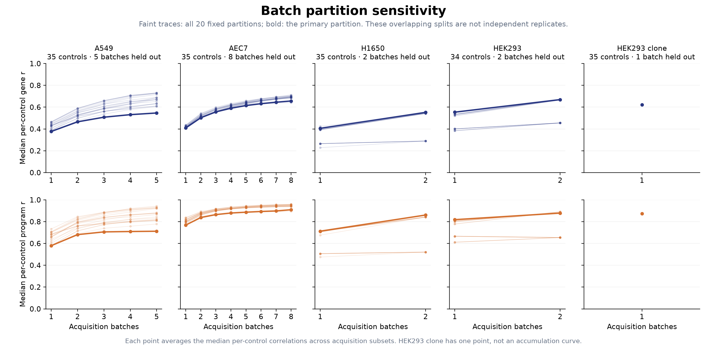

# What pairing and additional batches contribute

This annex compares exact image/RNA well pairing and the accumulation of control batches. It includes result tables, fixed sample memberships and analysis settings for interpreting both comparisons.

## Exact well pairing retains predictive information

Exact pairs and within-control/batch shuffles use the same training wells, fitted preprocessing and **2,287 correctly paired test wells**. Shuffling changes the training image-to-RNA correspondence within control/batch groups. Group means and scaling use training observations only.

| Training wells | Exact-pair RNA r | Shuffled RNA r | Exact-pair R² | Shuffled R² |
|---:|---:|---:|---:|---:|
| 350 | 0.0455 | −0.0031 | −0.2171 | −0.2505 |
| 1,000 | 0.0763 | 0.0028 | −0.0893 | −0.1229 |
| 3,000 | 0.1009 | −0.0008 | −0.0295 | −0.0621 |
| 8,000 | 0.1248 | 0.0007 | 0.0029 | −0.0309 |

Values average three exact fits or fifteen shuffled fits per size. Targets are the same-well assay's native **D00–D31 RNA coordinates**, distinct from core P01–P32 gene programs. Exact pairing adds predictive information, while absolute explained variance remains modest. Testing holds out wells within the same two batches and 35 controls; it does not test an unseen batch, control or cell line. [Exact summary](evidence/pairing_summary.csv).

## Additional measured batches improve response agreement

At each size, all subsets of acquisition batches are averaged with equal batch weights and compared with a disjoint batch reference. The primary statistic averages, across those subsets, the median control-profile correlation over 6,000 genes. **The figure above and table below use `split_seed=20260915`**, one of the 20 saved acquisition/reference partitions.

| Context | Common controls | Held-out batches | Acquisition batches | Gene r, first → last |
|---|---:|---:|---|---|
| A549 | 35 | 5 | 1 → 5 | 0.377 → 0.547 |
| AEC7 | 35 | 8 | 1 → 8 | 0.409 → 0.657 |
| H1650 | 35 | 2 | 1 → 2 | 0.406 → 0.552 |
| HEK293 | 34 | 2 | 1 → 2 | 0.554 → 0.669 |
| HEK293 clone | 35 | 1 | 1 only | 0.622 |

HEK293 uses the 34 controls present in every batch. The clone context has only two batches, so it supplies one comparison rather than an accumulation curve. The figure's second row shows separate projections onto the current core program basis. [Exact results](evidence/batch_accumulation_summary.csv).

Twenty fixed, overlapping partitions (`split_seed=20260915` through `20260934`) show sensitivity to the split. At the final acquisition-batch count, the saved gene-correlation endpoints span:

| Context | Final acquisition batches | Endpoint range across 20 partitions |
|---|---:|---:|
| A549 | 5 | 0.547–0.732 |
| AEC7 | 8 | 0.641–0.713 |
| H1650 | 2 | 0.289–0.552 |
| HEK293 | 2 | 0.455–0.669 |
| HEK293 clone | 1 | 0.622–0.622 |

These ranges summarize existing rows of [batch_accumulation_summary.csv](evidence/batch_accumulation_summary.csv), using `mean_median_gene_pearson` at each context's largest `n_acquisition_batches`. Small batch counts cause some seeds to repeat the same split or its reversal. Shading, traces and endpoint ranges are observed partition sensitivity, not confidence intervals from independent experiments. This comparison shows how additional batches affect agreement; it does not identify an optimal experiment size or separate the effects of more batches and more wells.

## Read and reuse the evidence

[Data guide](DATA_GUIDE.md) identifies the figure inputs, saved fits, batch partitions and per-control results. [Same-well data](../annex_same_well/README.md) and [control pseudobulks](../annex_controls/README.md) supply the corresponding processed measurement layers. The separate [microscopy gallery](../gallery/README.md) shows actual source crops linked by compound ID.

The [same-well sample-size curve](figures/same_well_learning_curve.png) uses the sampling unit: total wells in the sampled cross-validation dataset. It changes sample size and does not by itself isolate a benefit from exact pairing.

[Methods and settings](METHODS.md) · [Machine-readable settings](analysis_settings.json).
