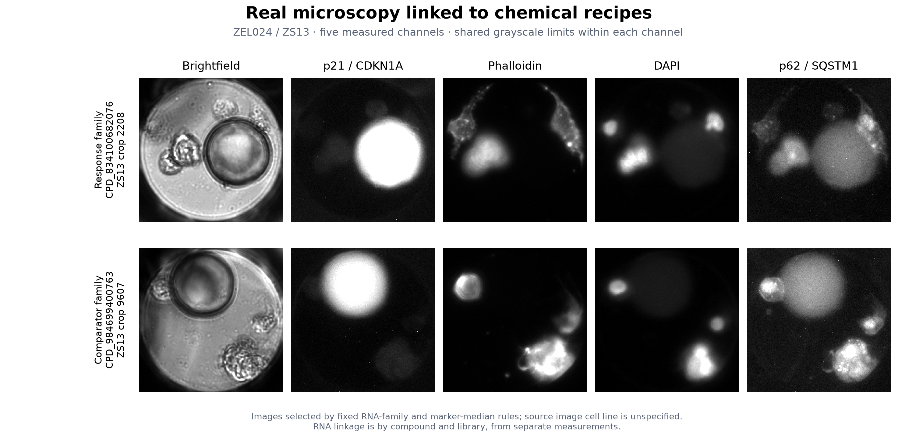
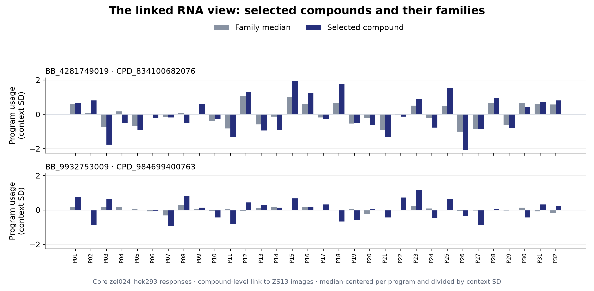

# Real microscopy, chemical recipes, and linked RNA responses

The gallery connects actual five-channel microscope crops to public chemical recipes and measured RNA-program responses. It makes the data's physical origin visible and gives readers a reproducible path from a component family to one compound, its image, and its RNA profile.



**Reading the image.** Each row is one preserved ZEL024 / ZS13 source crop. Columns show brightfield, p21/CDKN1A, phalloidin, DAPI, and p62/SQSTM1. Channel-specific grayscale limits are identical across the two rows. The full source crop retains cells, the well region, and a large bead region. No image was generated, retouched, or selected after visual inspection.

The source image metadata does not supply a cell-line field. These images are linked to the `zel024_hek293` RNA context by **compound ID and library**; that RNA label does not establish the image cell line. The image and RNA records are not same-well measurements. For the separately measured same-well control study, see [measurement design](../annex_measurement_design/README.md).

## How the examples were chosen

The rule was frozen before inspecting the images: identify supported component families by their measured RNA response, choose a compound nearest its family's response median among image-supported candidates, then choose its crop nearest its own marker median. The comparator follows the same rule at the same recipe position. [Methods and all eligibility rules](METHODS.md) specify the selection exactly.

| Selection | Response family | Comparator family |
|---|---|---|
| Component at recipe position `bb3` | `BB_4281749019` | `BB_9932753009` |
| Measured compounds in the family | 168 | 168 |
| Eligible image-supported representatives | 7 | 7 |
| Selected compound | `CPD_834100682076` | `CPD_984699400763` |
| Source crop index | 2208 | 9607 |
| Valid crops for selected compound | 3 | 3 |
| Segmented cells in displayed crop | 5 | 4 |
| Norm of family median standardized RNA response | 3.332 | 0.727 |

“Response family” means the largest family-median RNA-response norm among 68 eligible families; “comparator” means the smallest eligible norm at the same position. Neither label is a potency, toxicity, or target assignment. Only seven compounds per selected family met the image-support criterion, so each displayed representative summarizes that eligible subset, with its distance from the full family median retained.

## The linked RNA view



Bars compare the selected compound with its 168-compound family median in each of the shared 32 RNA programs. For display, each core program is centered on the context median and divided by that context's standard deviation. These are transformations of measured, batch-harmonized compound surfaces and their basis projections, described in [core methods](../docs/METHODS.md); they are not per-cell expression values.

This pair of images illustrates the connection between measurement layers. It does not establish a p21 or p62 effect, an image-defined mechanism, or a causal contribution from the shared component. The [selected-family distributions](evidence/selected_family_distribution.csv), [all family scores](evidence/family_selection_scores.csv), and [candidate crop scores](evidence/representative_crop_candidates.csv) expose the surrounding measurements instead of treating two crops as a statistical comparison.

## Reproduce and inspect

From the release root, with NumPy, pandas, PyArrow and matplotlib installed:

```bash
python gallery/build_gallery.py
```

The command reselects the same examples using only public inputs, checks the raw crop hashes, and redraws both figures. It needs neither the source HDF5 archive nor external services. [Data guide](DATA_GUIDE.md) documents the exported files; [analysis access](../docs/ANALYSIS_ACCESS.md) covers additional source inputs.
